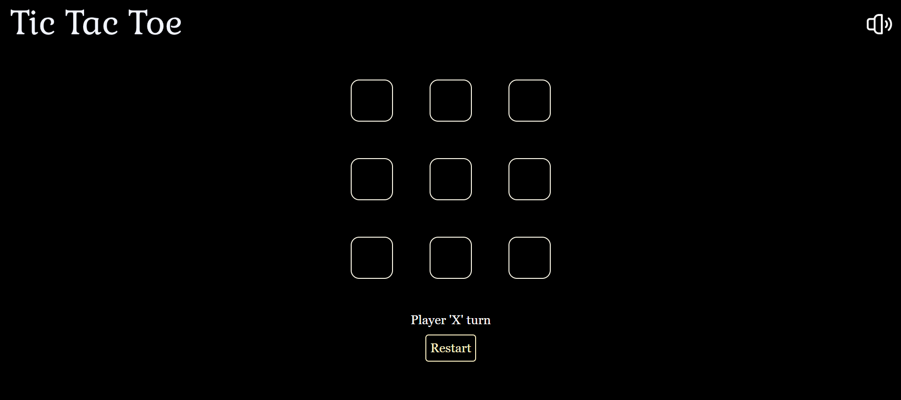

# ❌⭕ Tic Tac Toe Game

A simple and fun Tic Tac Toe (X & O) game built using HTML, CSS, and JavaScript. Playable in-browser with clean UI and instant result detection.

[🔗 Live Demo](https://amannagar04.github.io/Tic-Tac-Toe-Game/)

## 🎮 Features

- 🆚 Two-player mode (Player X vs Player O)
- ✅ Win/draw detection with instant result display
- ♻️ Reset/restart game button
- 📱 Responsive layout for desktop and mobile
- 💡 Highlight winning combinations (if implemented)

## 🛠️ Tech Stack

- HTML5
- Tailwind CSS
- ReactJS

## 📸 Screenshots



## 🚀 How to Use

### 1. Clone the repository
```bash
git clone https://github.com/amannagar04/Tic-Tac-Toe.git
cd Tic-Tac-Toe
```

### 2. Run the Game

- Open folder in terminal.
- Run command: npm run dev


## 🔮 Future Enhancements (Optional)

- 💻 Single-player mode with AI
- 🔀 Player turn animation
- 🌗 Dark mode toggle
- 📊 Scoreboard for multiple rounds

## 🧠 Learning Goals

This project is great for practicing:
- DOM manipulation
- Event handling
- Game logic implementation
- Responsive design using CSS

---

> Made with ❤️ by [Aman Nagar](https://github.com/amannagar04)
